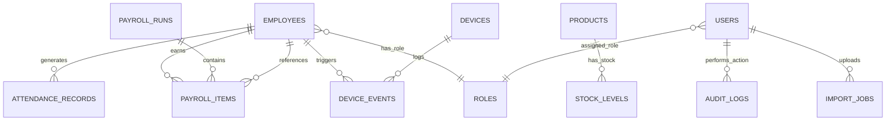

# Entity Relationship Diagram - Warehouse Management System

## System Architecture Overview



## Collection Cardinalities

| From | To | Relationship | Cardinality |
|------|-----|--------------|------------|
| EMPLOYEES | ATTENDANCE_RECORDS | generates | 1:N |
| EMPLOYEES | PAYROLL_ITEMS | earns | 1:N |
| EMPLOYEES | DEVICE_EVENTS | triggers | 1:N |
| EMPLOYEES | ROLES | has_role | N:1 |
| DEVICES | DEVICE_EVENTS | logs | 1:N |
| PAYROLL_RUNS | PAYROLL_ITEMS | contains | 1:N |
| PRODUCTS | STOCK_LEVELS | has_stock | 1:N |
| USERS | ROLES | assigned_role | N:1 |
| USERS | AUDIT_LOGS | performs_action | 1:N |
| USERS | IMPORT_JOBS | uploads | 1:N |

## Key Relationships Explained

### 1. **Employees ↔ Attendance Records** (1:N)
- One employee → many daily attendance records (IN/OUT)
- Critical for payroll calculations
- Indexes: `(employeeId, timestamp)`

### 2. **Employees ↔ Payroll Items** (1:N)
- One employee → many monthly/weekly payroll lines
- Tracks full pay history with deductions

### 3. **Devices ↔ Device Events** (1:N)
- One biometric device → many raw events
- Raw logs before aggregation
- Maintains audit trail of all clock events

### 4. **Payroll Runs ↔ Payroll Items** (1:N)
- One monthly payroll run → line items per employee
- Atomically processes entire payment cycle

### 5. **Products ↔ Stock Levels** (1:N)
- One product SKU → stock at multiple warehouse locations
- Enables multi-location inventory tracking

### 6. **Users ↔ Roles** (N:1)
- Multiple users may share same role
- Simplifies permission management (Admin, Manager, Staff, HR)

---

## Data Flow Overview

```
Excel Sheets (Source)
        ↓
  Import Jobs (Validation & Staging)
        ↓
MongoDB Collections (Normalized)
        ↓
API Endpoints (REST/GraphQL)
        ↓
Frontend (React/Vue)
```

### Critical Paths for Payroll Processing:

```
Device Events (Raw) 
    → Attendance Records (Cleaned)
    → Payroll Items (Computed)
    → Payroll Runs (Aggregated)
    → Audit Logs (Change History)
```

---

## Next Steps
- [ ] Review MongoDB schema validators in `schemas/`
- [ ] Set up indexes for performance
- [ ] Create sample data for testing
- [ ] Implement API endpoints for each collection
- [ ] Configure RBAC for users/roles
